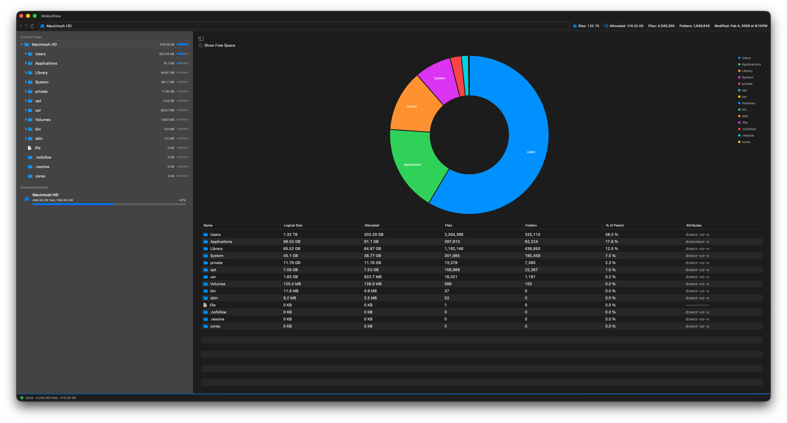

# Moku View

[](https://github.com/eeexception/MokuView/actions/workflows/tests.yml)
[](https://github.com/eeexception/MokuView/actions/workflows/build_dmg.yml)
[](https://github.com/eeexception/MokuView/releases/latest)
[](LICENSE)

A fast, modern macOS application designed to analyze your disk space, visualize directories, and easily find large files. Moku View helps you track and clean up your drive providing a clean, responsive, and native interface.



## Features
- Fast asynchronous disk scanning and analysis.
- Intuitive directory navigation with accurate size calculations.
- Native macOS UI with precise file system integration.
- Smooth context menu support for quick actions (e.g., move files to Trash). 

## Prerequisites 
- macOS (built natively for Apple platforms).
- Xcode (to build from source) and [XcodeGen](https://github.com/yonaskolb/XcodeGen) for generating the project.

## Installation & Security

Since this is an open-source project and is not signed by an Apple Developer certificate, macOS might prevent it from running the first time.

If you see a message saying the developer cannot be verified:
1. Locate the app in your **Applications** folder.
2. **Right-click** (or Control-click) the application icon and select **Open**.
3. Click **Open** in the dialog that appears.

After this, the app will open normally with a double-click.

## Getting Started

### Using Xcode
1. Generate the project using XcodeGen:
   ```bash
   xcodegen generate
   ```
2. Open the generated `MokuView.xcodeproj`.
3. Select the `MokuView` scheme and press `Cmd + R` to build and run.

### Using Command Line
1. Generate the project:
   ```bash
   ./tools/update_project.sh
   ```
2. Build the application:
   ```bash
   ./tools/build.sh
   ```
   The build will be located at `build/Release/MokuView.app`.

## Development Tools

The `tools/` directory contains several utility scripts:

- `update_project.sh`: Re-generates the Xcode project file using XcodeGen.
- `generate_icons.py`: Generates the macOS AppIcon set from `assets/icon.png`. Requires `Pillow`.
- `build.sh`: Orchestrates project generation and building the `.app` bundle.
- `build_dmg.sh`: Packages the built `.app` into a `.dmg` installer.
- `release.sh`: Handles the full release process: builds the app, generates a DMG, updates the changelog, and creates/pushes a Git tag.
- `release.py`: A Python helper used by `release.sh` to parse Git logs and update `CHANGELOG.md`.

## Testing

### Using Xcode
- Press `Cmd + U` to run all unit tests in the `MokuViewTests` target.

### Using Command Line
- Run the following command to execute tests:
  ```bash
  xcodebuild test -scheme MokuView -destination 'platform=macOS'
  ```


## License

```text
 Moku View
 Copyright (C) 2026 eeexception

 This program is free software: you can redistribute it and/or modify
 it under the terms of the GNU General Public License as published by
 the Free Software Foundation, either version 3 of the License, or
 (at your option) any later version.

 This program is distributed in the hope that it will be useful,
 but WITHOUT ANY WARRANTY; without even the implied warranty of
 MERCHANTABILITY or FITNESS FOR A PARTICULAR PURPOSE.  See the
 GNU General Public License for more details.

 You should have received a copy of the GNU General Public License
 along with this program.  If not, see <https://www.gnu.org/licenses/>.
```

See the full [LICENSE](LICENSE) file for exact details on how you may use, distribute, and modify this project.
